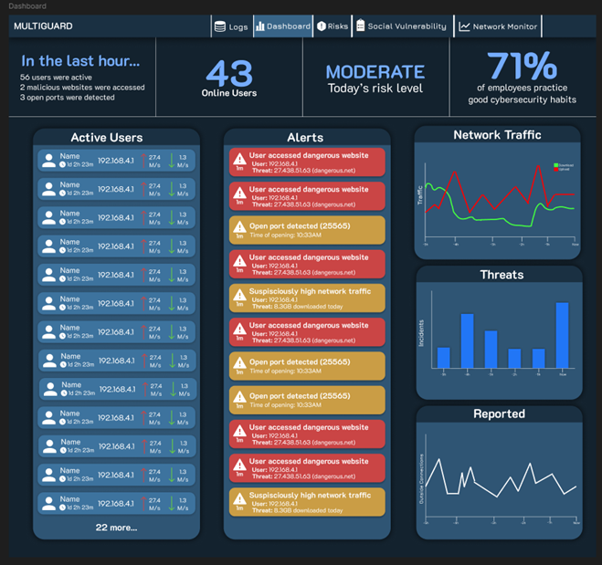
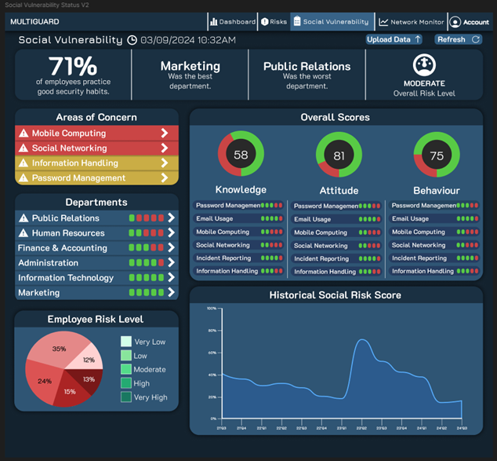
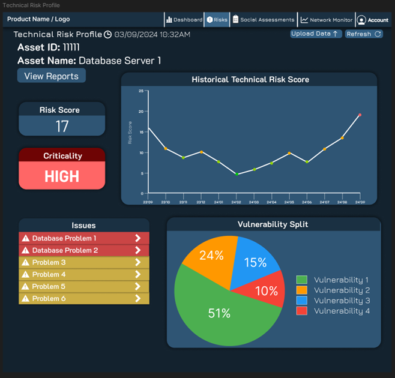

# Macroergonomic Dashboard for Data Breach Analysis

A web-based dashboard designed to analyse socio-technical factors contributing to data breaches by integrating human, organisational, and technical risk indicators.

---

## Project Overview

This project was developed as part of a university capstone to address the growing need for **enhanced cybersecurity awareness across organisations**.

Traditional dashboards focus primarily on technical vulnerabilities. This project takes a **macroergonomic approach**, analysing:

- Human behaviour (e.g., password practices, social engineering susceptibility)
- Organisational factors (e.g., policies, awareness)
- Technical risks (e.g., vulnerabilities, network exposure)

The goal is to provide a **holistic view of breach risk**, enabling better-informed security decisions.

> The dashboard incorporates survey-based data and technical indicators to model real-world breach susceptibility. :contentReference[oaicite:1]{index=1}

---

## Dashboard Preview

### Main Dashboard

### Social Risk Analysis

### Technical Risk Analysis

---

## Key Features

- **Multi-Domain Risk Modelling**
  - Combines human, organisational, and technical risk factors into a unified analysis

- **Interactive Visualisations**
  - Displays risk relationships through charts and dashboards for intuitive exploration

- **Survey-Based Risk Assessment**
  - Uses behavioural questionnaires (Knowledge-Attitude-Behaviour model) to evaluate human risk factors :contentReference[oaicite:2]{index=2}

- **Technical Risk Integration**
  - Incorporates network scanning and vulnerability insights to complement social risk analysis

- **User-Centric Design**
  - Designed using usability heuristics to ensure clarity and ease of navigation :contentReference[oaicite:3]{index=3}

---

## Tech Stack

- **Frontend:** HTML, CSS, JavaScript  
- **Backend:** Flask (Python)  
- **Database:** MySQL  
- **Data Processing:** Python  
- **Infrastructure:** Docker, Nginx  
- **Security Tooling:** Nmap (network scanning)

---

## Evaluation & Results

The dashboard was evaluated through structured user testing:

- Average user confidence score: **4.6 / 5**
- Users found the interface **intuitive and easy to navigate**
- Improvements were made based on feedback (e.g., clearer labels, improved navigation)

> Users were able to complete multiple analysis tasks efficiently, validating the usability of the system :contentReference[oaicite:4]{index=4}

---

## Key Learnings

- Security is not purely technical — **human behaviour is a critical attack surface**
- Visualisation plays a major role in **security decision-making**
- Balancing usability and analytical depth is challenging but essential
- Integrating multiple data sources requires careful structuring and abstraction

---

## Future Improvements

- Integrate **third-party vulnerability feeds** for richer technical insights
- Expand dataset for more accurate risk modelling
- Add **real-time monitoring and alerting**
- Introduce **predictive analytics / ML-based risk scoring**
- Improve scalability for enterprise-level deployment

---

## Challenges

- Limited data availability restricted full risk modelling capabilities
- Time constraints impacted implementation of advanced features
- Balancing simplicity with depth in dashboard design
- Quantifying social risk as business risk 

